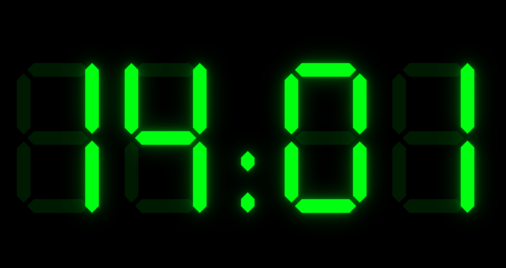

# Digital Clock Web App

A lightweight, zero-dependency digital clock web application designed for both desktop and mobile devices. This app features real-time updates, customizable settings, and offline support.



---

## Features

- **Real-Time Clock**: Displays the current time, updating every 500ms.
- **Alarm Functionality**: Set alarms with a sunrise animation to ease into your day.
- **Responsive Design**: Adapts seamlessly to landscape and portrait orientations.
- **Customizable Settings**: Change clock color, alarm time, and sunrise duration.
- **Offline Support**: Works offline using a service worker with a cache-first strategy.
- **Fullscreen Mode**: Immersive experience with a single click.

---

## File Structure

```
index.html   # Main application (HTML + CSS + JS)
manifest.json        # PWA web app manifest
sw.js                # Service worker (cache-first, offline support)
icon-192.png         # PWA icon — 192×192 px
icon-512.png         # PWA icon — 512×512 px
agent.md             # Developer documentation
readme.md            # Project overview (this file)
```

---

## How to Use

1. **Open the App**: Launch the `index.html` file in any modern browser.
2. **Set an Alarm**: Use the settings panel to configure an alarm time.
3. **Customize**: Adjust the clock color and sunrise duration to your preference.
4. **Go Fullscreen**: Click outside the settings panel for an immersive view.

---

## Run with Docker

1. **Build the Docker Image**:
   ```bash
   docker build -t digital-clock .
   ```

2. **Run the Container**:
   ```bash
   docker run -p 8080:80 digital-clock
   ```

3. **Access the App**:
   Open your browser and navigate to `http://localhost:8080`.

---

## Installation

No installation required! Simply open the `index.html` file in your browser. For offline use, add the app to your home screen or desktop.

---

## License

This project is licensed under the MIT License.